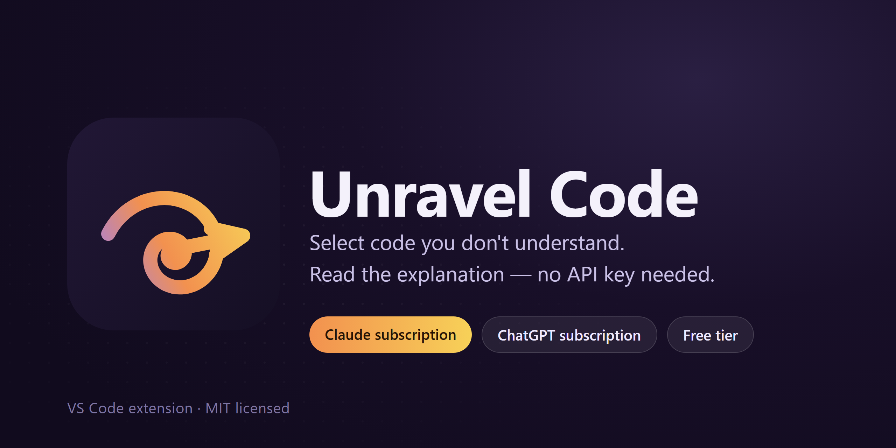

  

# Unravel Code

**Select code you don't understand. Read the explanation.** No API key, no signup — it runs on the
Claude or ChatGPT subscription you already have.

**Türkçe açıklama için [aşağı kaydırın](#türkçe).**

---

## Three steps

1. **Select** the code you don't understand
2. Press **`Ctrl+Alt+U`** (macOS: `Cmd+Alt+U`)
3. The explanation streams into a side panel

That's it. The panel stays open and updates on your next selection.

## Screenshots

> _Placeholder — to be replaced with real screenshots/GIFs before release._

| Explaining code | Unpacking a regex |
| --- | --- |
| `docs/screenshot-explain.png` (placeholder) | `docs/screenshot-regex.gif` (placeholder) |

## What it's for

**Reading someone else's code.** What a function you inherited actually does, what it touches, how
control flows through it — step by step.

**Untangling a regex.** Breaks the pattern into pieces, explains the capture groups, gives matching
and non-matching examples, and flags catastrophic backtracking — it will tell you why a pattern
like `/^(a+)+$/` can hang your server.

**Legacy code you're afraid to touch.** What the code was probably meant to do, what to check
before changing it, and where a safer modern approach exists.

You don't pick the mode — it reads the selection and decides. If it guesses wrong, switch modes in
the panel; you don't have to select anything again.

## In the panel

| Control | What it does |
| --- | --- |
| **Code / Regex / Legacy** | Switches mode and re-runs **the same selection**. |
| **Brief / Detailed** | Changes how deep the explanation goes, same selection. |
| **Stop** | Cuts off a long explanation. |
| **Copy** | Copies the explanation — handy for a PR comment. |

## Setup

Open **Unravel: Open Settings** from the Command Palette (or the gear icon in the Unravel panel's
title bar) for a visual picker — it shows what's actually installed on your machine and lets you
choose with one click, no `settings.json` editing required. The steps below describe the same
choices manually, if you'd rather.

Pick one. **None of the first three asks you for an API key.**

### A) Your Claude subscription — the default

1. Install [Claude Code](https://claude.com/claude-code) and run `claude` once to sign in.
2. Select code → `Ctrl+Alt+U`.

No settings to change: `unravelCode.auth` is already `claudeCode`. Unravel hands the request to
your local Claude Code and your subscription covers it. The credential belongs to Claude Code —
Unravel never sees or stores it.

### B) Your ChatGPT subscription

1. Install the official **ChatGPT** extension (`openai.chatgpt`) and sign in with your ChatGPT account.
2. Set `unravelCode.auth` → `vscodeLm` and `unravelCode.lmPreferred` → `openai`.

No separate CLI needed. The ChatGPT extension registers its models with the VS Code Language Model
API, and Unravel picks them up from there.

### C) Free, to try it out

Set `unravelCode.auth` → `vscodeLm` and leave `unravelCode.lmPreferred` empty (or `copilot`).
Whichever model provider you have installed gets used — **GitHub Copilot's free tier** is enough,
and it doesn't ask for a card.

> **Heads up:** Copilot Free allows 50 chat requests a month, and Unravel's requests come out of
> that same quota. For heavy use, choose A or D.

### D) An Anthropic API key

`Ctrl+Shift+P` → **Unravel: Set API Key**, paste a key from the
[Anthropic Console](https://console.anthropic.com/), then set `unravelCode.auth` → `apiKey`.

This is the fastest path — first word in ~0.6s, against ~2s for A, where ~1.4s is Claude Code's own
startup. You pay per use in exchange.

> There is also `unravelCode.auth` → `codex` for people who prefer the Codex CLI
> (`npm i -g @openai/codex` + `codex login`). Note that `codex exec --json` emits no incremental
> text, so **that mode does not stream** — the answer appears all at once when it is done.

## Privacy

This extension does not accumulate your code anywhere. Concretely:

- **Only your selection leaves.** Not the whole file — the selection plus an optional ±N lines of
  surrounding context (default 5; set `0` for selection only).
- **Secrets are masked before sending.** Known patterns — API keys, tokens, private keys,
  `password=` — are redacted automatically, and the panel tells you how many values were masked.
  **This cannot be turned off.**
- **No telemetry.** No usage, errors, or code content is logged anywhere.
- **No middleman server.** Requests go straight to Anthropic or to the local client you chose.
  There is no backend of ours in between.
- **Your code is never written to disk.** In Claude Code and Codex modes the selection is passed to
  the child process over stdin, never as a command-line argument — so it does not show up in a
  process listing either. Those modes also disable tools (Bash, Read, Write, WebFetch…) and MCP
  servers, and run in a neutral working directory so your project's `CLAUDE.md` cannot bleed into
  the request.
- **Your API key lives only in `SecretStorage`.** Never in `settings.json`, the repo, or a log. In
  paths A, B, and C you never enter one at all.

## Settings

| Setting | Values | Default | Description |
| --- | --- | --- | --- |
| `unravelCode.auth` | `claudeCode`, `codex`, `vscodeLm`, `auto`, `apiKey` | `claudeCode` | Where the credential comes from. The default uses local Claude Code and your Claude subscription. |
| `unravelCode.lmPreferred` | `openai`, `copilot`, `claude`… | `""` | In `vscodeLm` mode, which provider to prefer. Matched against the model's vendor and family. |
| `unravelCode.language` | `auto`, `tr`, `en` | `auto` | Explanation language. `auto` follows the VS Code display language. |
| `unravelCode.detail` | `brief`, `detailed` | `detailed` | How deep the explanation goes. |
| `unravelCode.model` | `claude-haiku-4-5`, `claude-sonnet-5` | `claude-haiku-4-5` | Model used on the Claude paths. |
| `unravelCode.contextLines` | number (≥0) | `5` | Lines of surrounding code sent along. `0` = selection only. |
| `unravelCode.claudeCodePath` | path | `""` | Path to the Claude Code executable. Empty = detect automatically. |
| `unravelCode.codexPath` | path | `""` | Path to the Codex executable. Empty = detect automatically. |
| `unravelCode.codexModel` | model name | `""` | Model for `codex` mode. Empty = whatever Codex itself is configured with. |

## Commands

| Command | Description |
| --- | --- |
| `Unravel: Explain Selection` | Explains the selection (mode detected automatically). |
| `Unravel: Explain as Regex` | Explains the selection as a regex. |
| `Unravel: Open Settings` | Opens the visual settings panel described above. |
| `Unravel: Set API Key` | Stores an Anthropic API key in `SecretStorage`. |
| `Unravel: Clear API Key` | Deletes the stored API key. |

**Explain Selection** and **Explain as Regex** are also in the editor right-click menu.

## FAQ

**Do I really not need an API key?**
You don't. The default hands off to Claude Code installed on your machine, which uses your Claude
subscription. With a ChatGPT subscription use path B; with neither, path C is free. An API key is
only an optional alternative.

**Is my code used for training?**
No. Code is sent only for that one explanation request and is not stored anywhere by this
extension. For the provider's own data policy, check that provider's terms.

**Will it change my code?**
No. This tool **only explains** — it will not refactor, write to files, or run commands. The narrow
scope is deliberate.

**Why does it sometimes say it is not sure?**
The model reads your code, it does not run it. When a behaviour is not certain, it is asked to say
so rather than guess. Better than a confident invention.

**Why does a very large selection not work?**
Selections over 20,000 characters are rejected before being sent. Select the block you don't
understand rather than the whole file — that is what the tool is designed for.

**Does Turkish mode translate technical terms?**
No. Terms like `async`, `callback`, and `capture group` stay in English; the explanation is in
Turkish.

**Is it free?**
The extension is free and open source (MIT). The model is paid for by the subscription you already
have or by your own API key — we never sit in between.

## License

MIT — see [LICENSE](./LICENSE).

---

# Türkçe

**Anlamadığınız kodu seçin, açıklamasını okuyun.** API key yok, hesap açma yok — zaten sahip
olduğunuz Claude veya ChatGPT aboneliğiyle çalışır.

## Üç adım

1. Anlamadığınız kodu **seçin**
2. **`Ctrl+Alt+U`** (macOS: `Cmd+Alt+U`)
3. Açıklama sağdaki panele akmaya başlar

Hepsi bu. Panel açık kalır ve bir sonraki seçiminizde güncellenir.

## Ne işe yarar

**Başkasının kodunu okurken.** Devraldığınız bir fonksiyon ne yapıyor, nelere dokunuyor, akış nasıl
ilerliyor — adım adım anlatır.

**Regex çözerken.** Deseni parçalara ayırır, capture group'ları açıklar, eşleşen ve eşleşmeyen
örnekler verir, catastrophic backtracking riskini işaretler — `/^(a+)+$/` gibi bir desenin
sunucunuzu neden kilitleyebileceğini söyler.

**Dokunmaya çekindiğiniz legacy kodda.** Kodun muhtemelen ne yapmak istediğini, değiştirmeden önce
nelere bakmanız gerektiğini ve daha güvenli modern bir yol varsa onu anlatır.

Modu siz seçmezsiniz — seçime bakıp kendisi karar verir. Yanlış tahmin ederse panelden
değiştirirsiniz, yeniden seçim yapmanız gerekmez.

## Panelde ne var

| Kontrol | Ne yapar |
| --- | --- |
| **Code / Regex / Legacy** | Modu değiştirir ve **aynı seçimi** yeniden çalıştırır. |
| **Brief / Detailed** | Açıklamanın derinliğini değiştirir, yine aynı seçimle. |
| **Stop** | Uzun süren bir açıklamayı keser. |
| **Copy** | Açıklamayı kopyalar — PR yorumuna yapıştırmak için birebir. |

## Kurulum

Command Palette'ten **Unravel: Open Settings** açın (ya da Unravel panelinin başlık çubuğundaki
dişli ikonuna tıklayın) — makinenizde gerçekten ne kurulu olduğunu gösteren görsel bir seçici
açılır, `settings.json` düzenlemeye gerek kalmaz. Aşağıdaki adımlar aynı seçimleri elle yapmak
isteyenler için.

Birini seçin. **İlk üçünün hiçbiri sizden API key istemez.**

### A) Claude aboneliğinizle — varsayılan

1. [Claude Code](https://claude.com/claude-code)'u kurun, bir kez `claude` çalıştırıp giriş yapın.
2. Kod seçin → `Ctrl+Alt+U`.

Ayar değiştirmenize gerek yok: `unravelCode.auth` zaten `claudeCode`. Unravel isteği yerel Claude
Code'unuza devreder, faturayı aboneliğiniz karşılar. Kimlik bilgisi Claude Code'a aittir — Unravel
onu ne görür ne saklar.

### B) ChatGPT aboneliğinizle

1. Resmî **ChatGPT** eklentisini kurun (`openai.chatgpt`), ChatGPT hesabınızla giriş yapın.
2. `unravelCode.auth` → `vscodeLm`, `unravelCode.lmPreferred` → `openai`.

Ayrı bir CLI kurmanız gerekmez. ChatGPT eklentisi modellerini VS Code'un Language Model API'sine
kaydeder, Unravel da oradan alır.

### C) Ücretsiz denemek için

`unravelCode.auth` → `vscodeLm`, `unravelCode.lmPreferred` boş kalsın (ya da `copilot`). VS Code'da
kurulu olan model sağlayıcısı kullanılır — **GitHub Copilot'ın ücretsiz katmanı** yeterlidir ve
kart istemez.

> **Dikkat:** Copilot Free ayda 50 chat isteğine izin verir ve Unravel'ın istekleri de aynı kotadan
> düşer. Yoğun kullanım için A veya D'yi seçin.

### D) Anthropic API key ile

`Ctrl+Shift+P` → **Unravel: Set API Key**, [Anthropic Console](https://console.anthropic.com/)'dan
aldığınız key'i yapıştırın, ardından `unravelCode.auth` → `apiKey` yapın.

En hızlı yol budur — ilk kelime ~0.6 saniyede gelir; A'da ~2 saniye, çünkü bunun ~1.4 saniyesi
Claude Code'un kendi açılışıdır. Karşılığında kullandıkça ödersiniz.

> Codex CLI'ı tercih edenler için `unravelCode.auth` → `codex` de vardır
> (`npm i -g @openai/codex` + `codex login`). Ancak `codex exec --json` metni parça parça
> vermediği için **o modda akış yoktur** — cevap bittiğinde tek seferde görünür.

## Gizlilik

Bu eklenti kodunuzu hiçbir yerde biriktirmez. Somut olarak:

- **Yalnızca seçiminiz gider.** Tüm dosya değil — seçim, artı isteğe bağlı ±N satır çevre kod
  (varsayılan 5; `0` yaparsanız sadece seçim).
- **Secret'lar gönderilmeden maskelenir.** API key, token, private key, `password=` gibi bilinen
  kalıplar otomatik maskelenir; panel kaç değerin maskelendiğini yazar. **Bu adım kapatılamaz.**
- **Telemetri yoktur.** Kullanım, hata veya kod içeriği hiçbir yere loglanmaz.
- **Aracı sunucu yoktur.** İstek doğrudan Anthropic'e ya da seçtiğiniz yerel istemciye gider;
  arada bize ait bir backend yoktur.
- **Kodunuz diske yazılmaz.** Claude Code ve Codex modlarında seçim child process'e stdin ile
  verilir, komut satırı argümanı olarak değil — yani process listesinde de görünmez. O modlarda
  araçlar (Bash, Read, Write, WebFetch…) ve MCP sunucuları kapatılır, istek nötr bir çalışma
  dizininde koşar; böylece projenizin `CLAUDE.md`'si isteğe karışamaz.
- **API key'iniz yalnızca `SecretStorage`'da durur.** `settings.json`'a, repoya veya log'a asla
  yazılmaz. Zaten A, B ve C yollarında hiç key girmezsiniz.

## Ayarlar

| Ayar | Değerler | Varsayılan | Açıklama |
| --- | --- | --- | --- |
| `unravelCode.auth` | `claudeCode`, `codex`, `vscodeLm`, `auto`, `apiKey` | `claudeCode` | Kimlik kaynağı. Varsayılan, yerel Claude Code'u ve Claude aboneliğinizi kullanır. |
| `unravelCode.lmPreferred` | `openai`, `copilot`, `claude`… | `""` | `vscodeLm` modunda hangi sağlayıcı tercih edilsin. Model'in vendor ve family adıyla eşleştirilir. |
| `unravelCode.language` | `auto`, `tr`, `en` | `auto` | Açıklama dili. `auto`, VS Code arayüz dilini takip eder. |
| `unravelCode.detail` | `brief`, `detailed` | `detailed` | Açıklamanın derinliği. |
| `unravelCode.model` | `claude-haiku-4-5`, `claude-sonnet-5` | `claude-haiku-4-5` | Claude yollarında kullanılacak model. |
| `unravelCode.contextLines` | sayı (≥0) | `5` | Gönderilecek çevre kod satırı sayısı. `0` = sadece seçim. |
| `unravelCode.claudeCodePath` | yol | `""` | Claude Code çalıştırılabilirinin yolu. Boşsa otomatik bulunur. |
| `unravelCode.codexPath` | yol | `""` | Codex çalıştırılabilirinin yolu. Boşsa otomatik bulunur. |
| `unravelCode.codexModel` | model adı | `""` | `codex` modunda kullanılacak model. Boşsa Codex'in kendi ayarı geçerlidir. |

## Komutlar

| Komut | Açıklama |
| --- | --- |
| `Unravel: Explain Selection` | Seçimi açıklar (mod otomatik algılanır). |
| `Unravel: Explain as Regex` | Seçimi regex olarak açıklar. |
| `Unravel: Open Settings` | Yukarıda anlatılan görsel ayarlar panelini açar. |
| `Unravel: Set API Key` | Anthropic API key'ini `SecretStorage`'a kaydeder. |
| `Unravel: Clear API Key` | Kayıtlı API key'i siler. |

**Explain Selection** ve **Explain as Regex** editör sağ tık menüsünde de yer alır.

## SSS

**Gerçekten API key gerekmiyor mu?**
Gerekmiyor. Varsayılan, makinenizde kurulu Claude Code'a devreder ve o sizin Claude aboneliğinizi
kullanır. ChatGPT aboneliğiniz varsa B yolu, hiçbiri yoksa C yolu ücretsizdir. API key yalnızca
isteğe bağlı bir alternatiftir.

**Kodum eğitim için kullanılıyor mu?**
Hayır. Kod yalnızca o tek açıklama isteği için gönderilir ve bu eklenti tarafından hiçbir yerde
saklanmaz. Sağlayıcının kendi veri politikası için o sağlayıcının şartlarına bakın.

**Kodumu değiştirir mi?**
Hayır. Bu araç **sadece açıklar** — refactor etmez, dosyaya yazmaz, komut çalıştırmaz. Kapsamın
dar olması bilinçlidir.

**Neden bazen "emin değilim" diyor?**
Model kodunuzu okur, çalıştırmaz. Bir davranıştan emin olmadığında tahmin yürütmek yerine bunu
söylemesi istenir. Kendinden emin bir uydurmadan iyidir.

**Çok büyük bir seçim neden çalışmıyor?**
20.000 karakterin üzerindeki seçimler gönderilmeden reddedilir. Dosyanın tamamı yerine
anlamadığınız bloğu seçin — araç bunun için tasarlandı.

**Türkçe modunda teknik terimler de çevriliyor mu?**
Hayır. `async`, `callback`, `capture group` gibi terimler İngilizce kalır; anlatım Türkçedir.

**Ücretsiz mi?**
Eklenti ücretsiz ve açık kaynaktır (MIT). Modelin bedelini zaten sahip olduğunuz abonelik ya da
kendi API key'iniz karşılar — arada biz durmayız.

## Lisans

MIT — bkz. [LICENSE](./LICENSE).
